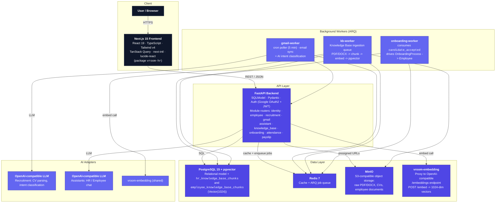
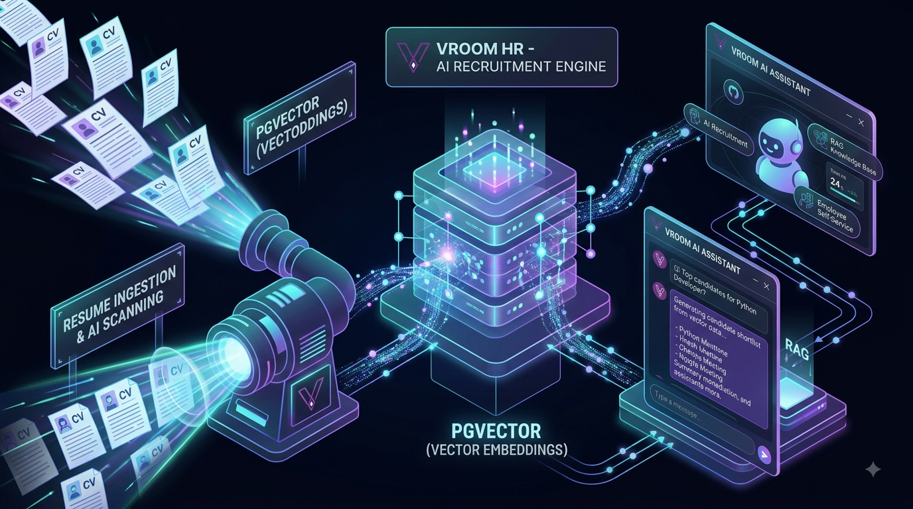
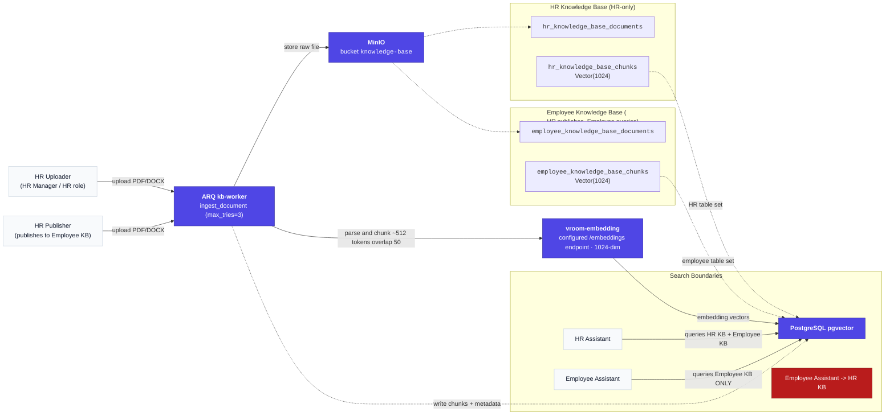
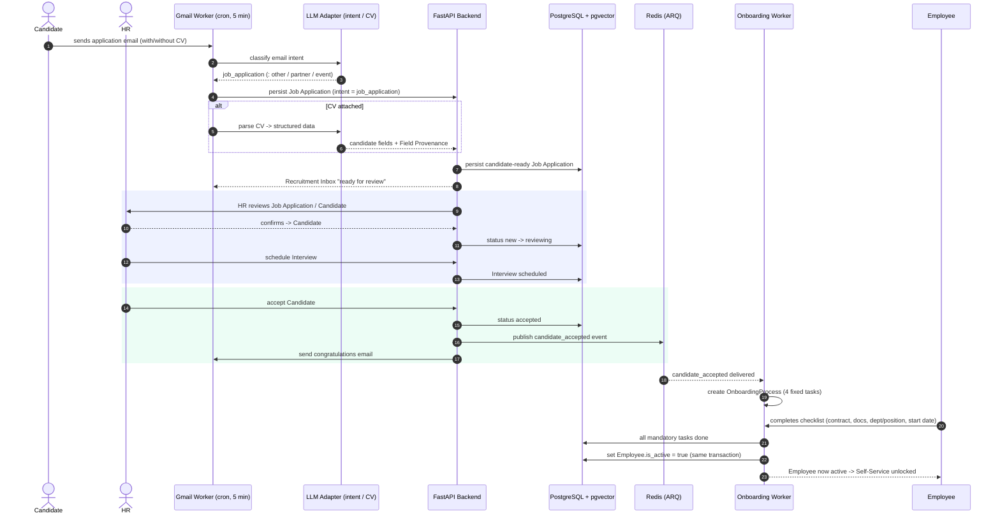

# Vroom HR — Technical Architecture

> Deep-dive technical documentation for **Vroom HR**, the open-source self-hosted Vietnamese HRM platform (Recruit - Onboard - Operate - Manage).

This document covers:

1. [System High-Level Architecture](#1-system-high-level-architecture)
2. [Dual-KB RAG Architecture](#2-dual-kb-rag-architecture)
3. [Backbone Flow Sequence](#3-backbone-flow-sequence)
4. [Architecture Layers](#4-architecture-layers)
5. [Security Boundaries & Data Isolation](#5-security-boundaries--data-isolation)
6. [Data Isolation Models](#6-data-isolation-models)

For the canonical domain glossary (Organization, Candidate, Onboarding, AI Assistant, Knowledge Base, Backbone Flow, and more), see [`CONTEXT.md`](./CONTEXT.md). Architectural decisions that shaped this system live in [`docs/adr/`](./docs/adr/).

---

## 1. System High-Level Architecture

Render of the full single-tenant deployment. Every component is a process (or container) that Vroom HR self-hosts; there is no shared or multi-tenant cloud.

**Reading guide.** A single HTTP client (browser) talks to the Next.js 15 frontend, which proxies API calls to the FastAPI backend. The backend is the only process that owns write access to PostgreSQL. All long-running or event-driven work (Gmail polling, Knowledge Base ingestion, onboarding) is delegated to ARQ workers running off the same Redis queue. LLM capability is reached through two adapter kinds: **pipeline calls** (CV parsing, intent classification) and **conversational assistant calls**; both use OpenAI-compatible endpoints, and embeddings go through the `vroom-embedding` service, which forwards to an OpenAI-compatible `/embeddings` endpoint configured by the operator.

---

## 2. Dual-KB RAG Architecture

Vroom HR maintains **two physically isolated knowledge bases**. Physical isolation is enforced at the schema level — separate tables for HR and Employee documents and chunks — so no code path can accidentally bleed HR-only content into an Employee query.

  

### Isolation rules

| Rule | Enforcement |
| --- | --- |
| **Schema-level isolation** | HR and Employee KBs use entirely separate tables (`hr_knowledge_base_documents`/`hr_knowledge_base_chunks` vs `employee_knowledge_base_documents`/`employee_knowledge_base_chunks`), each with its own `Vector(1024)` chunk table. |
| **Raw files** | Both KBs share the MinIO `knowledge-base` bucket, but `storage_path` is scoped per KB and metadata (`kb_type`) disambiguates. |
| **HR Assistant** | May retrieve from **both** HR KB and Employee KB (it has full HR read access). |
| **Employee Assistant** | May retrieve from the **Employee KB only**. The cross-boundary query (`Employee Assistant → HR KB`) is **blocked** at the retrieval layer and never reachable. |
| **Write path** | Only HR (via the uploader/publisher flow) enqueues ingestion jobs. Employees have no document-write path. |

### Ingestion pipeline

1. HR uploads a PDF/DOCX through the client → the backend `/api/knowledge-base` router writes document metadata (`status = pending`) and enqueues an `ingest_document` ARQ job on the `kb-worker` queue.
2. The **kb-worker** pulls the job (Redis), stores the raw file in MinIO, and parses it (PDF via PyMuPDF, DOCX via python-docx).
3. The document is split into chunks of ~512 tokens with ~50-token overlap (`KB_CHUNK_SIZE_TOKENS`, `KB_CHUNK_OVERLAP_TOKENS`).
4. Each chunk is embedded via the **vroom-embedding** service, which batches the chunks onto the configured OpenAI-compatible `/embeddings` endpoint → 1024-dim vector.
5. Chunks + vectors + metadata are written to the appropriate table set in PostgreSQL (**pgvector**), and `status` flips to `indexed`. Failed jobs retry up to 3 times before the final failure is recorded.

---

## 3. Backbone Flow Sequence

This is the single core workflow the project is built around: **email → AI-recognized Job Application → CV parse → Candidate → HR review → Interview → Accept → congratulations → Onboarding → Employee**.

### Sequence notes

- **Email ingestion** runs on a 5-minute cron (`gmail-worker`). Only emails classified as `job_application` enter the recruitment pipeline; the other intents (`partner`, `event`, `internal`, `other`) follow their respective routing.
- **Job Application ≠ Candidate.** An application becomes a Candidate only when HR confirms it has enough information or accepts it into the pipeline.
- **Human-in-the-loop:** every state transition that matters (review, schedule, accept) is an explicit HR action; AI only *proposes*.
- **Acceptance flips the switch:** publishing `candidate_accepted` to Redis is the trigger for the **onboarding-worker**, which builds the `OnboardingProcess` (4 fixed tasks), and only after all mandatory tasks plus department/position/manager/start-date are complete does `Employee.is_active` become `true` — atomically in the same DB transaction as the final task.
- Headcount is counted by **accepted candidates**, not by onboarding completion (see `CONTEXT.md` → Job Opening).

---

## 4. Architecture Layers

### 4.1 Client / Frontend (`frontend/`, package `vroom-hr`)

- **Next.js 15, React 19, TypeScript, Tailwind CSS v4**, TanStack Query for server state, `next-intl` for i18n (Vietnamese-first), `lucide-react` icons.
- Talks to the backend exclusively over REST/JSON (`NEXT_PUBLIC_API_URL`). Authentication is cookie-based (`HttpOnly` JWT) via `middleware.ts`.
- Design system: **AI Studio** (slate + single indigo accent, Be Vietnam Pro/JetBrains Mono). See `DESIGN.md`.

### 4.2 API Layer (FastAPI Backend)

Python ≥ 3.11 FastAPI application (`backend/src/main.py`) that wires module routers and a single PostgreSQL data model via **SQLModel** (SQLAlchemy). Key modules:

| Module | Responsibility |
| --- | --- |
| `identity` | Auth (Google OAuth2 + JWT), roles (`SYSTEM_ADMIN`/`HR`/`Employee`), Organization allowed login domains, audit logs, first-run setup. |
| `recruitment` | Candidate pipeline, Job Openings, CV parsing + intent classification, Recruitment Inbox, runtime & evaluation. |
| `gmail` | Organization Google Connection, email sync, audit, AI classification. |
| `knowledge_base` | Dual-KB document/chunk storage, ingestion orchestration, retrieval. |
| `assistant` | HR AI Assistant (read + draft tools) and Employee AI Assistant (employee-scoped). |
| `onboarding` | `OnboardingProcess`, activation of Employees. |
| `employee` | Employee CRUD, departments, positions, documents. |
| `attendance`, `employee_request`, `payslip` | Operate & Manage feature set. |

The backend is the **single owner** of database writes; workers write only through their own module services.

### 4.3 Background Workers (ARQ, Redis-backed)

| Worker | Entrypoint | Behavior |
| --- | --- | --- |
| `gmail-worker` | `arq src.modules.gmail.worker.WorkerSettings` | Cron poller every `GMAIL_POLL_INTERVAL_SECONDS` (default 300s). Syncs the Organization mailbox and classifies intent; exits cleanly when no connection is configured. |
| `kb-worker` | `arq src.modules.knowledge_base.worker.KnowledgeBaseWorkerSettings` | Queue consumer (`kb-worker` queue) for `ingest_document`; `max_tries = 3`; also maintains a Redis heartbeat every few minutes for runtime health. |
| `onboarding-worker` | `arq src.modules.onboarding.worker.OnboardingWorkerSettings` | Queue consumer for `candidate_accepted`; `max_tries = 3`; drives `OnboardingProcess` and activates employees. |

### 4.4 Data Layer

- **PostgreSQL 15 + pgvector** — relational HR model plus two `Vector(1024)` chunk tables for the dual KBs.
- **Redis 7** — cache and ARQ job/broker backbone.
- **MinIO** — S3-compatible object storage for raw documents (`knowledge-base` bucket), CVs (`recruitment-cv`), and employee documents.
- **vroom-embedding** — FastAPI service exposing `GET /health` and `POST /embed`, returning 1024-dim vectors. It holds no model itself: it forwards to whichever OpenAI-compatible `/embeddings` endpoint `EMBEDDING_API_BASE_URL` names (a cloud API, or a local one such as vLLM/TEI if data locality is required), splitting requests into provider-sized batches and verifying vector width at startup. Runs as its own container and is shared by the KB ingestion and retrieval paths.

### 4.5 AI Adapters

Both **AI Automation** (pipeline: CV parse, intent classification) and the **AI Assistants** (conversational read/draft) use OpenAI-compatible endpoints (`RECRUITMENT_LLM_*`, `ASSISTANT_LLM_*`). The distinction is architectural:

- **AI Automation** = event-driven, no conversation. Classifies emails and parses CVs. This is a pipeline, not an agent.
- **AI Assistant** = conversational, **read-only + draft-only**. Exposes only two tool kinds — **Read-Tools** (live data reads) and **Draft-Tools** (structured proposals) — and never a write tool. Writes happen only via real HR-confirmed endpoints (human-in-the-loop).
- **AI Agent (autonomous)** = explicitly out of current scope; a forward-looking direction only.

---

## 5. Security Boundaries & Data Isolation

1. **Single-tenant isolation.** One deployment = exactly one Organization. No `tenant_id`-based multi-tenancy is in play; `tenant_id` in legacy policy code is a frozen constant. Data privacy is absolute by topology, not by access-control policy.
2. **Role separation.** `SYSTEM_ADMIN` (infrastructure: Google OAuth, LLM keys, audit) vs `HR` (business HR data) vs `Employee` (own data via Self-Service). System Admin is *strictly blocked* from HR business data; HR cannot touch infrastructure secrets.
3. **AI boundary is structural, not conventional.** The LLM is never given a tool capable of writing to the database. The HR Assistant can only *draft* (it proposes; HR confirms and calls a real endpoint). The Employee Assistant additionally cannot touch the HR Knowledge Base or other employees' data.
4. **Dual-KB physical isolation.** Separate tables per KB (see §2) — an Employee query cannot reach HR-only chunks even with a retrieval bug, because the data lives in different tables.
5. **Secrets.** JWT signing key, password salt, OAuth token encryption key are base64/hex secrets that must be rotated in production (`backend/.env.example` documents generation commands). OAuth tokens are encrypted at rest (AES-256-GCM).
6. **Network topology (Docker).** `vroom-internal-net` is an internal-only network; only `postgres`, `redis`, `minio`, and the workers live there. The `vroom-public-net` carries only the backend, frontend, and embedding service (which needs outbound access to the configured embeddings endpoint via configured DNS).

## 6. Data Isolation Models

| Concern | Model |
| --- | --- |
| Companies | **Singleton Organization** per deployment — isolation by physical separation, not by shared-service tenancy. |
| Knowledge Bases | **Dual, physically isolated tables** (HR KB vs Employee KB) with role-scoped retrieval. |
| Employees | **Employee Self-Service** scoping — each employee account reads/writes only its own records; Employee Assistant reads only the asking employee's data. |
| AI writes | **Human-in-the-loop** — assistants draft, HR confirms; no autonomous DB writes in the current scope. |
| Object storage | S3 buckets partitioned by purpose (`knowledge-base`, `recruitment-cv`, `employee-documents`) with presigned access. |

---

*For the full glossary of domain terms and constraints referenced here, see [`CONTEXT.md`](./CONTEXT.md). For the governance / documentation standard that defines this file, see [`docs/adr/0011-github-repository-governance-and-documentation-standard.md`](./docs/adr/0011-github-repository-governance-and-documentation-standard.md).*